## Wohin muss man gucken, um den Speicher-Hinweis zu sehen?

- **Desktop:** ganz **unten rechts** in der Fenster-Ecke — ein winziges, hellgraues „✓ Gespeichert HH:MM", das nach 3 s zusätzlich halb verblasst.
- **Mobile:** rechts, **knapp über der unteren Navigationsleiste** — noch blasser, die Uhrzeit ist kaum erkennbar.

Unten pro Tab je ein Screenshot. Für die vier Editor-Tabs (Etappen, Inhalt, Versand, Alerts) zusätzlich der **Zwischenzustand direkt nach der Änderung** („Speichere …" = noch nicht gespeichert). Für Übersicht/Vorschau gibt es nichts zu speichern → nur der Ruhezustand.

> Alle Bilder liegen auch im Repo unter `docs/design-requests/issue-955-save-indicator/` (falls die Einbettung bei dir nicht rendert).

Basis-Pfad der Bilder: `github.com/henemm/gregor_zwanzig/blob/main/docs/design-requests/issue-955-save-indicator/`

---

# 🖥️ Desktop — Indikator unten rechts

### Übersicht (kein Editor → Ruhezustand)
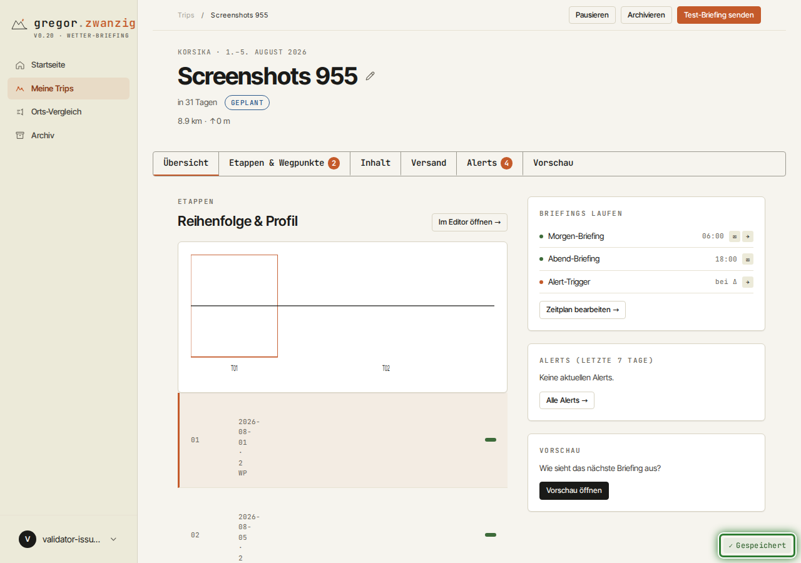

### Etappen & Wegpunkte
Nach Datums-Änderung — „✓ Gespeichert HH:MM" unten rechts:
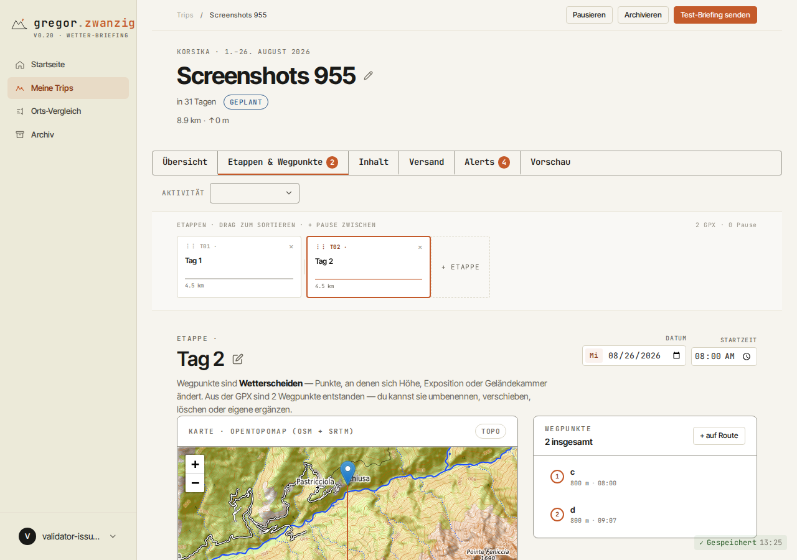
Direkt nach der Änderung („Speichere …"):

### Inhalt
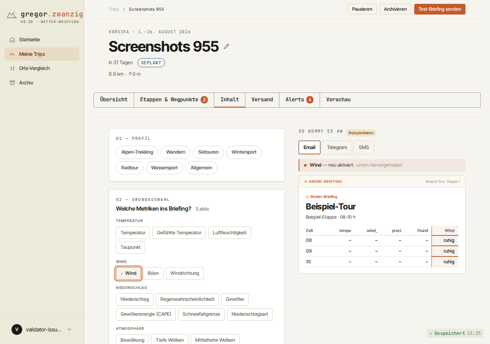
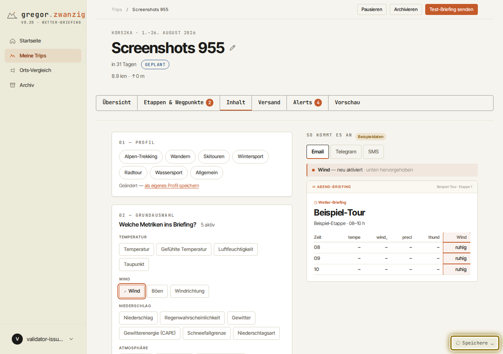

### Versand
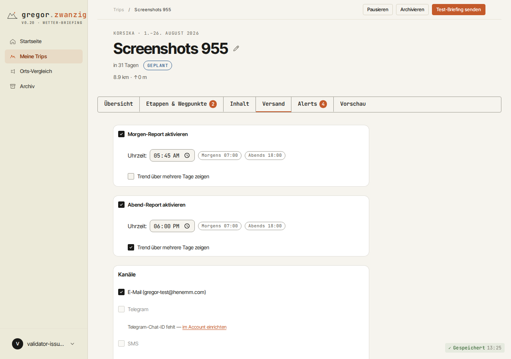

### Alerts
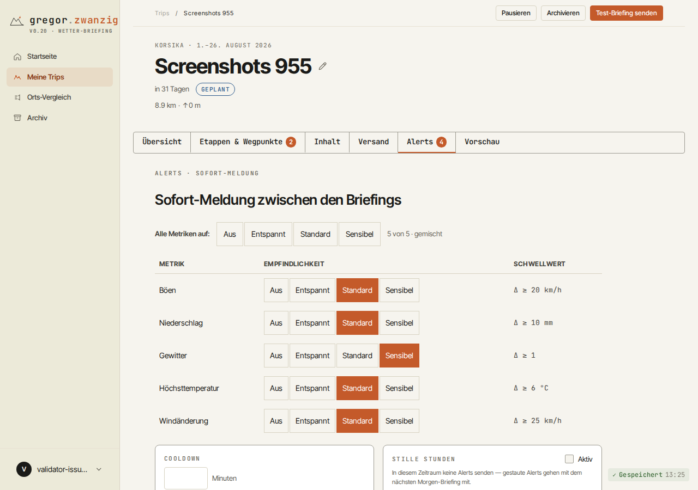
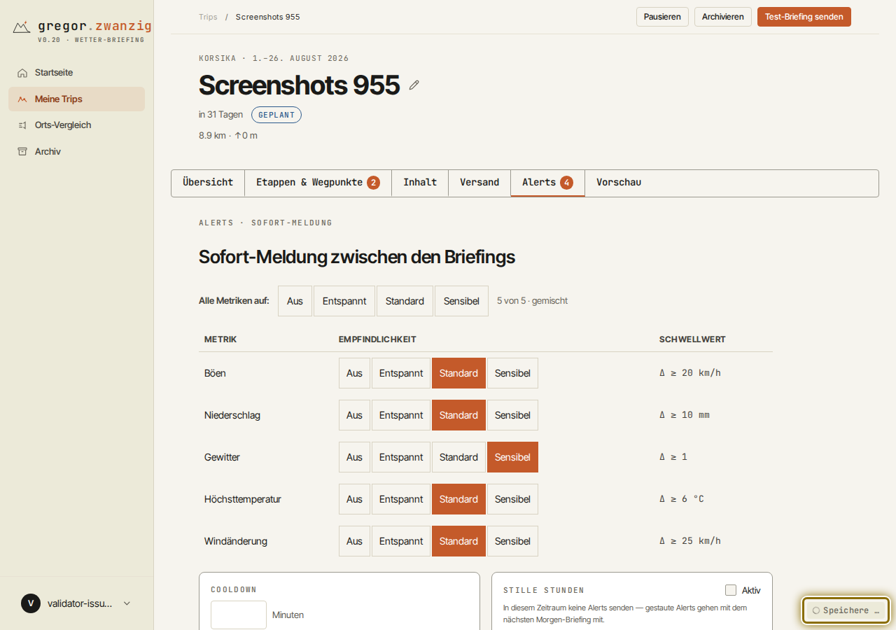

### Vorschau (kein Editor → Ruhezustand)
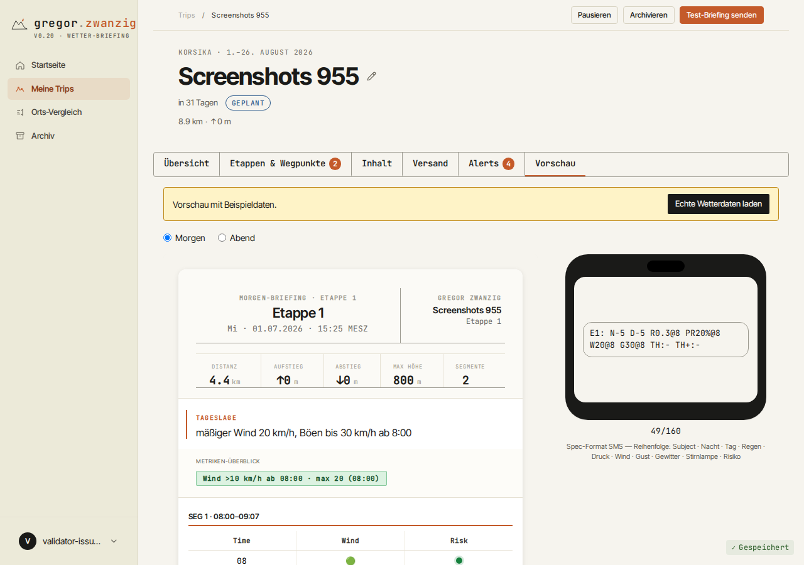

---

# 📱 Mobile — Indikator über der unteren Leiste

### Übersicht
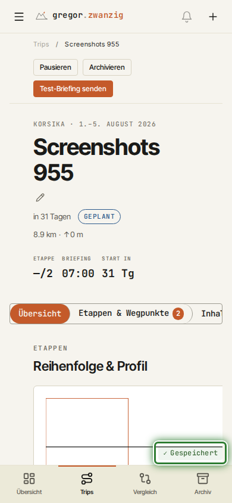

### Etappen & Wegpunkte
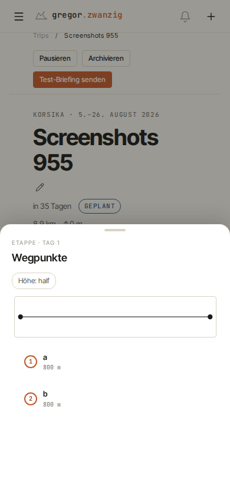

### Inhalt
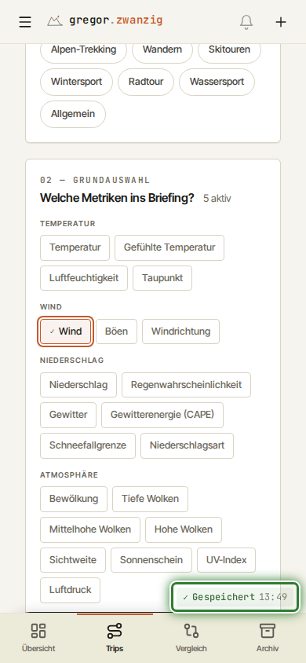
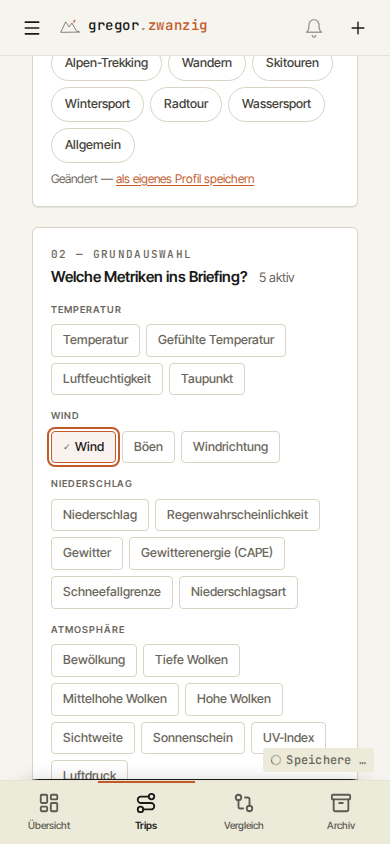

### Versand

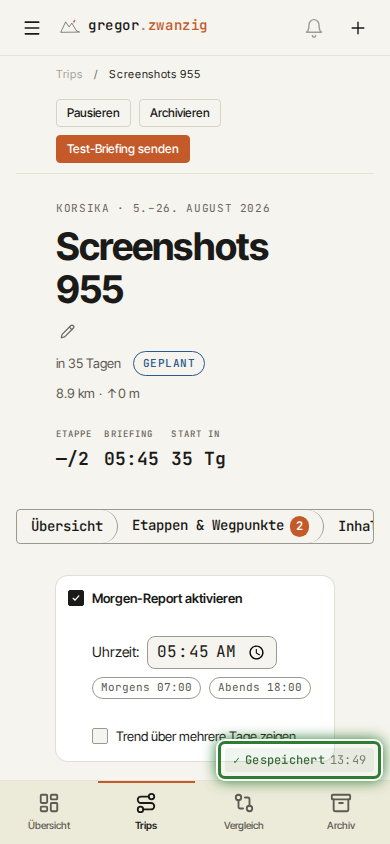

### Alerts

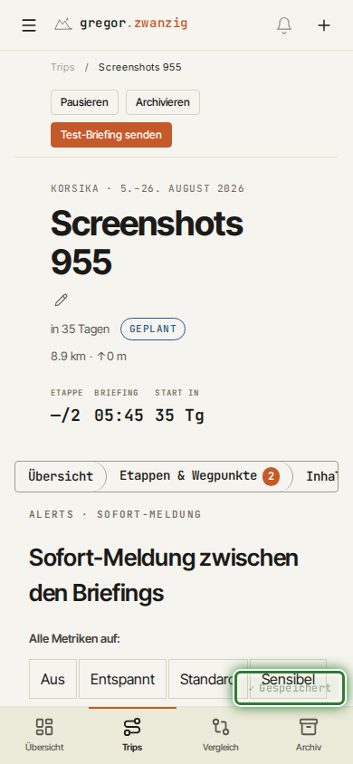

### Vorschau
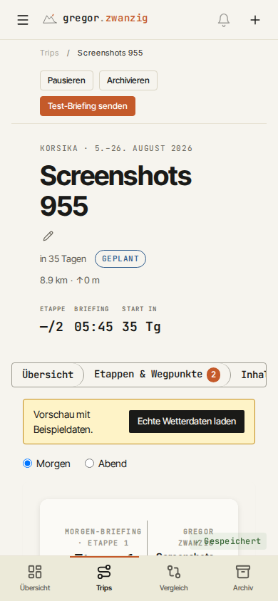

---

## Beobachtung (für die Design-Entscheidung)

- Der Indikator ist **derselbe** auf allen Editor-Tabs (globales Overlay), nur die anderen Tab-Inhalte wechseln.
- Er ist **klein (≈12px), hellgrau, in der Ecke** und **verblasst nach 3 s** — deshalb der Eindruck „ich sehe nirgends einen Hinweis".
- Auf **Mobile** überlagert er fast die untere Leiste und ist noch schwerer zu lesen.
- Ein „ungespeichert/Nicht gespeichert"-Dauerzustand existiert im Trip-Editor **nicht** — es wird sofort automatisch gespeichert, der Indikator springt kurz auf „Speichere …" und dann auf „Gespeichert HH:MM". (Ausnahme: der Inhalt-Tab hat zusätzlich eine „Ungespeicherte Änderungen"-Pille am oberen Rand.)

**Offene Design-Frage:** prominenter machen (Größe/Kontrast/Position/Dauer) — und wenn ja, wie? Kandidaten z. B.: kurz mittig aufblendende Bestätigung statt dauerhaft-blass in der Ecke; oder Indikator dauerhaft im Kopfbereich neben dem Trip-Namen.

🤖 Generated with [Claude Code](https://claude.com/claude-code)
